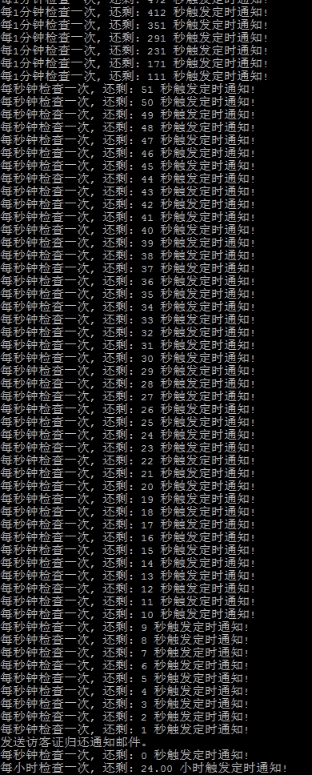

# 基于nodejs实现每天固定时间发送邮件服务

### 1.需求背景
实现一个每天固定时间（比如每天上午 10:00 ）发送邮件的功能。


### 2.实现思路

比如要实现每天上午 10:00 发送邮件。

基本的思路就是写一个定时器，不断的去检测时间是否为10:00，是的话就触发。

假设距离 10:00 的秒数为 x，
 
>  当 x > 1 小时时，每隔 1 小时触发一个检测

>  当 x < 1 小时 && x > 10 分钟时，每隔 10 分钟触发一次检测

>  当 x < 10 分钟 && x > 1 分钟时，每隔 1 分钟触发一次检测

>  当 x < 1 分钟时，每隔 1 秒钟触发一次检测

 
### 3.实现代码如下

```javascript
--demo
  -index.js // 调用 timersService
  -timersService.js // 核心代码
```

demo/index.js
```javascript
const timersService = require('./timersService').timersService;

const sendNotification = async () => {
  console.log('------------------------------------------------');
  console.log('发送邮件通知！(发送邮件的逻辑放在这儿！)');
  console.log('------------------------------------------------');
};

timersService(sendNotification);
```


demo/timersService.js

```javascript
const moment = require('moment');

function execWhenTime(hour, minute, second, fn) {

  const seconds = hour * 3600 + minute * 60 + second;

  let timer = null;
  let timerValue = null;

  let currentH;
  let currentM;
  let currentS;
  let currentSeconds;

  let active = false;

  const timerFn = () => {
    currentH = parseInt(moment().format('HH'), 10);
    currentM = parseInt(moment().format('mm'), 10);
    currentS = parseInt(moment().format('ss'), 10);
    currentSeconds = currentH * 3600 + currentM * 60 + currentS;

    if (currentSeconds - seconds >= 0 && currentSeconds - seconds <= 3600 && !active) {
      clearInterval(timer);
      fn();
      timerValue = 3600001;
      timer = setInterval(timerFn, timerValue);
      active = true;
    }

    const remainSeconds = seconds - currentSeconds >= 0 ? seconds - currentSeconds : seconds - currentSeconds + 24 * 3600;
    if (seconds - currentSeconds > 3610 || seconds - currentSeconds < 0) {
      console.log(`每小时检查一次, 还剩: ${(remainSeconds / 3600).toFixed(2)} 小时触发定时通知!`);
      // 每小时执行一次
      if (timerValue !== 3600000) {
        active = false;
        timerValue = 3600000;
        clearInterval(timer);
        timer = setInterval(timerFn, timerValue);
      }
    } else {
      if (seconds - currentSeconds > 610) {
        console.log(`每10分钟检查一次, 还剩: ${remainSeconds} 秒触发定时通知! `);
        // 每10分钟执行一次
        if (timerValue !== 600000) {
          timerValue = 600000;
          clearInterval(timer);
          timer = setInterval(timerFn, timerValue);
        }
      } else {
        if (seconds - currentSeconds > 65) {
          console.log(`每1分钟检查一次, 还剩: ${remainSeconds} 秒触发定时通知!`);
          // 每分钟执行一次
          if (timerValue !== 60000) {
            timerValue = 60000;
            clearInterval(timer);
            timer = setInterval(timerFn, timerValue);
          }
        } else {
          console.log(`每秒钟检查一次, 还剩: ${remainSeconds} 秒触发定时通知!`);
          // 每秒钟执行一次
          if (timerValue !== 1000) {
            timerValue = 1000;
            clearInterval(timer);
            timer = setInterval(timerFn, timerValue);
          }
        }
      }
    }
  };

  timerFn();

}

exports.timersService = (fn) => {
  execWhenTime(20, 30, 50, fn);
};
```

### 4.Example


